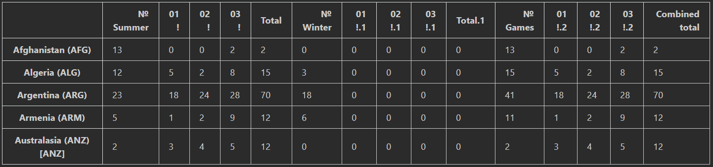
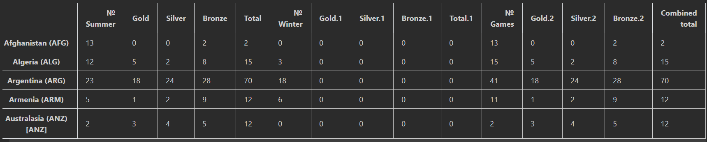
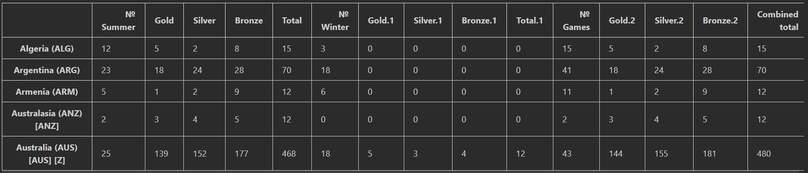
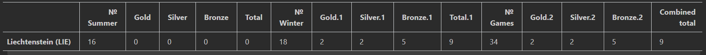
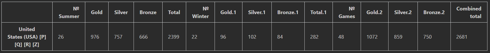
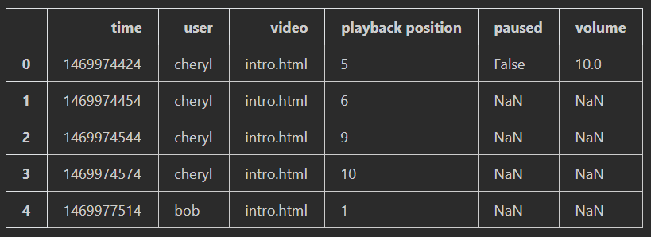
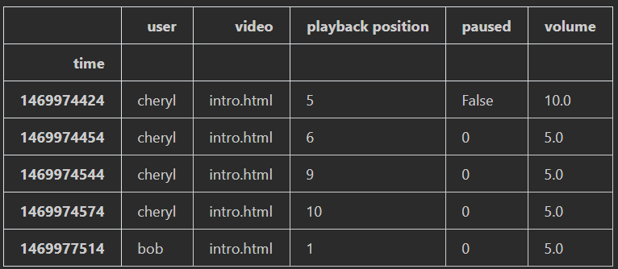
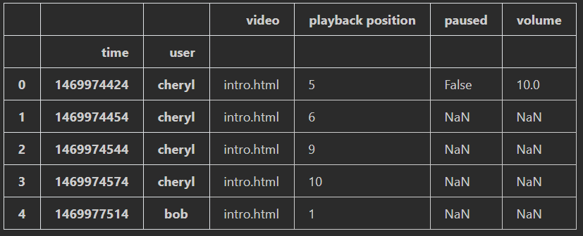
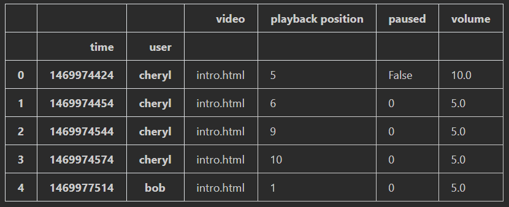
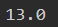

# TP0 - Machine Learning

## Open the Jupyter Notebooks
```CMD
jupyter-lab
```
#### copy one the links that appear on the cmd on Internet

---

## Part 1 - Olympics.csv

### Installation of libraries
```Python
import pandas as pd
```
### Obtention of olympics.csv
```Python
olympics = pd.read_csv("D:\efrei\cours\s7\machine learning\lab1\olympics.csv", index_col = 0, skiprows = 1)

olympics.head()
```


### 1) Rename the columns "01 !", "02 !" and "03 !" as "Gold", "Silver" and "Bronze" in a function
```Python
def rename_medals(df):
    for col in df.columns:

        if col[:2] == '01':
            df.rename(columns = {col:'Gold' + col[4:]}, inplace = True)

        if col[:2] == '02':
            df.rename(columns = {col:'Silver' + col[4:]}, inplace = True)

        if col[:2] == '03':
            df.rename(columns = {col:'Bronze' + col[4:]}, inplace = True)
    return df


olympics = rename_medals(olympics)
```


### 2) Display the country that has won at least one Gold Medal
```Python
at_least_one_gold = olympics[(olympics['Gold'] > 0) | (olympics['Gold.1'] > 0)]

at_least_one_gold.head()
```



### 3) Display the country that has won only Winter Gold Medal
```Python
only_winter_gold = olympics[(olympics['Gold.1'] > 0) & (olympics['Gold'] == 0)]

only_winter_gold.head()
```



### 4) Which country got the most number of medals
```Python
max_medals = olympics[:-1]
max_medals = max_medals[max_medals['Combined total'] == max_medals['Combined total'].max()]
max_medals
```


---

## Part 2 - Log.csv

### Installation of libraries
```Python
import numpy as np
import pandas as pd
import matplotlib.pyplot as plt
```
### Obtention of log.csv
```Python
log = pd.read_csv("D:\efrei\cours\s7\machine learning\lab1\log.csv")

log.head()
```


### 1) Set the time to be the new index. and sort the dataframe based on this index

```Python
log.set_index('time', inplace = True)

log.head()
```


### 2) Reset the index to be the time and the user
```Python
log.reset_index(inplace = True)
log.set_index(['time', 'user'], inplace = True, append = True, drop = False)

log.head()
```


### 3) Replace the NaN values as follows:
### a.	Use the average value on the column 'volume'
### b.	Use 0 on 'paused'
```Python
#a
log['volume'] = log['volume'].replace(np.nan, 5)

#b
log['paused'] = log['paused'].replace(np.nan, 0)

log.head()
```


### 4.	Display the average
```Python
log['playback position'].mean()
```

